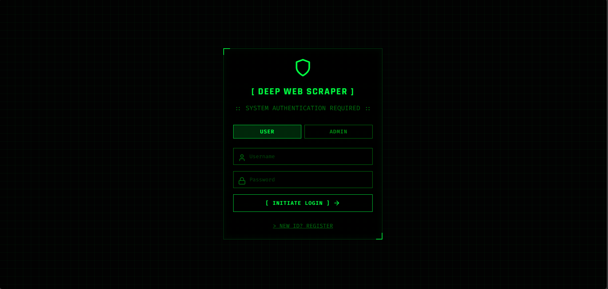
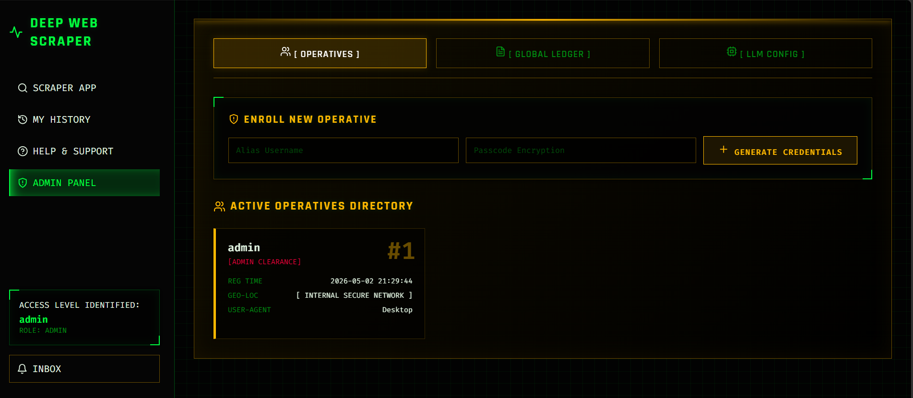
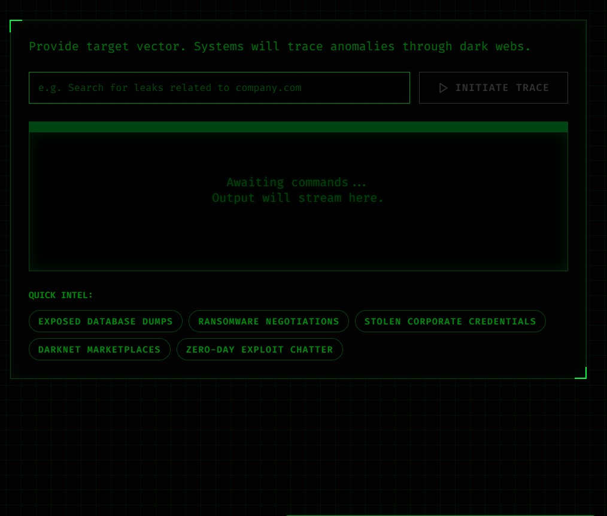
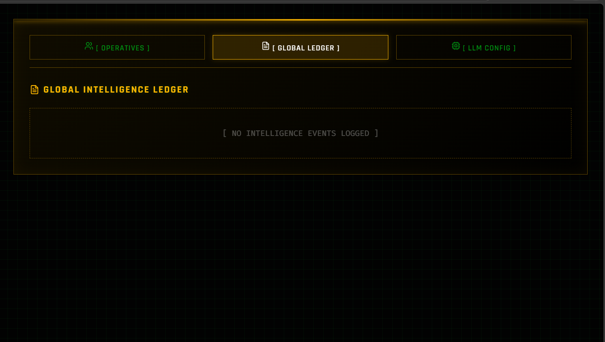
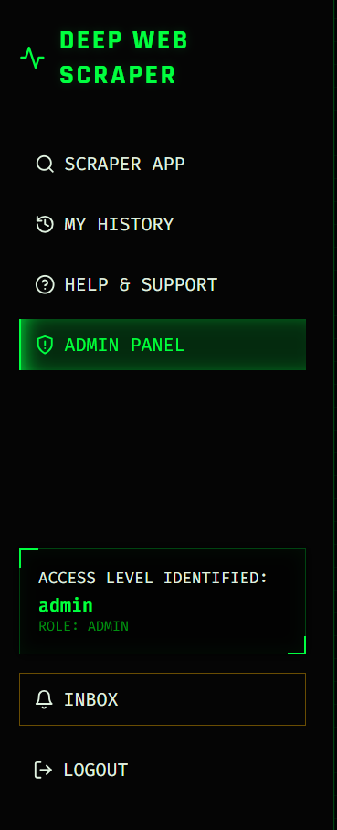
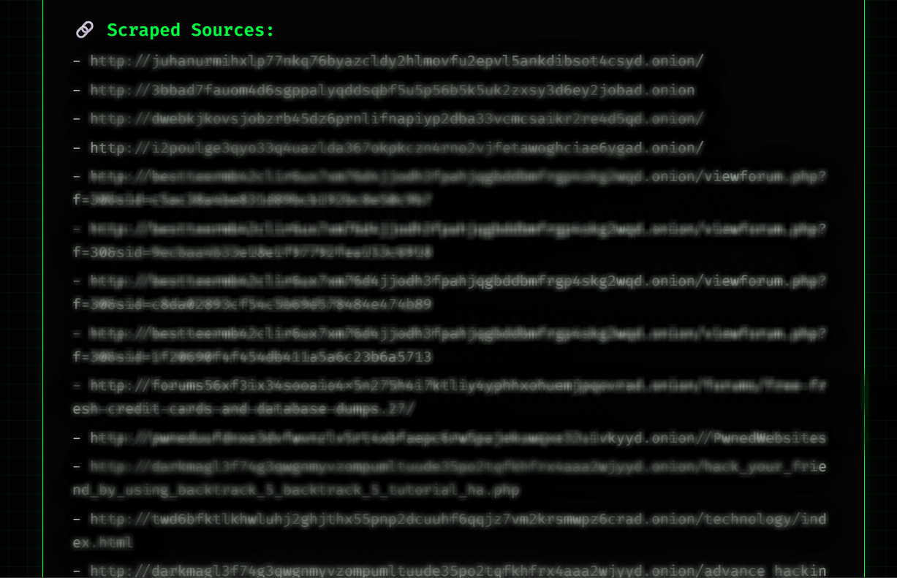

# Scraper

Scraper is a robust, local-first intelligence application designed to search the Dark Web and analyze intelligence data using various Large Language Models (LLMs). It provides a sleek web-based dashboard and a secure Admin Panel for managing users and history.

### 🛠️ Built With
* **Frontend**: React (v18.2.0), Vite (v5.0.0), Lucide Icons (v0.294.0)
* **Backend**: FastAPI (v0.136.1), Uvicorn (v0.46.0)
* **AI & Logic**: LangChain (v1.3.2), OpenAI SDK (v2.33.0)
* **Scraping**: BeautifulSoup4 (v4.14.3), Requests (v2.33.1), PySocks (v1.7.1)
* **Database**: SQLite (Native Python 3)

---

## 📸 Application Gallery

Here is a glimpse of the Scraper UI in action:

<p align="center">
  
  
  
</p>
<p align="center">
  
  
  
</p>

---

## 🚀 Quick Start Guide

### 1. Prerequisites
> [!IMPORTANT]
> Before running the application, make sure you have the following installed on your machine:
> * **Python 3.8+**
> * **Tor Service**: Required to access `.onion` links. 
>   * *Windows*: Download the Tor Expert Bundle or keep the Tor Browser running in the background.
>   * *macOS*: `brew install tor` and run `brew services start tor`
>   * *Linux*: `sudo apt install tor` and run `sudo systemctl start tor`

### 2. Environment Configuration
The application relies on API keys to communicate with your preferred AI models.

> [!NOTE]
> 1. Locate the `.env.example` file in the root directory.
> 2. Rename the file to `.env` (or create a copy named `.env`).
> 3. Open the `.env` file and add your API keys. 
> 
> *You do not need all of them. The application will dynamically enable only the models for which you have provided an API key.*

### 3. Installation
> [!TIP]
> To install the required dependencies, run the following command in your terminal:
> ```bash
> pip install -r requirements.txt
> ```

### 4. Running the Application
> [!TIP]
> For Windows users, simply double-click the included batch file:
> ```bash
> start_scraper.bat
> ```
> This will automatically launch the backend server on port `8501` and open the application in your default web browser.

Alternatively, you can run it manually via terminal:
```bash
python -m uvicorn api:app --host 0.0.0.0 --port 8501
```

---

## 🔐 Default Credentials

Upon first launch, the database (`storage.db`) is automatically created with a default administrator account.

* **Admin Username**: `admin`
* **Admin Password**: `123`

> **Note:** It is highly recommended that you change this password if you plan to expose this application to any external network. To change it, delete `storage.db`, add `ADMIN_PASSWORD=your_new_password` to your `.env` file, and restart the application.

---

## 🛠️ Usage & Features

* **Login/Registration**: Users can create basic accounts to save their search queries and histories. The admin account provides oversight over all instances.
* **LLM Selection**: From the main dashboard, use the dropdown menu to select your desired AI model. Only models configured in your `.env` file will be available.
* **Dark Web Scraping**: Enter search queries. The application will route the request through Tor, scrape dark web links, and feed the data to your selected LLM to generate an intelligence report.
* **Admin Panel**: Log in as `admin` to access the Admin Panel. From here, you can oversee all users, review global search histories, scrub data, and view user feedback.

---

## ❓ Frequently Asked Questions (FAQ)

### 1. I am getting an "Unsupported LLM model" error.
**Answer:** This happens if the model name stored in your database or selected in the UI does not have its corresponding API key set in the `.env` file. 
- Open the `.env` file and make sure the key (e.g., `OPENAI_API_KEY`, `GROQ_API_KEY`) is populated.
- Restart the backend.

### 2. The Application says "Backend Connection Error" or is not loading.
**Answer:** This means the FastAPI Python backend isn't running on port `8501`. 
- Ensure you have installed the requirements.
- Check your terminal output for any syntax errors or missing modules.
- Ensure no other application is currently using port `8501`. 

### 3. I see an "Unexpected Indentation" or "Parse Error" in my IDE on `llm.py`.
**Answer:** This is a false positive from some IDE linters! The application uses large, multi-line string variables (using `"""`) for the AI's system prompts. Some code editors incorrectly try to read these English instructions as if they were Python code. You can completely ignore these visual warnings. Do not modify the text to "fix" the indentation, as it might break the AI prompts.

### 4. Why can't I see search results from the Dark Web?
**Answer:** The scraper tool requires Tor to access `.onion` links. If Tor is not running natively on your machine, or is blocked by your ISP, the scraper will fail to fetch pages and return empty summaries.

### 5. I submitted Feedback in the dashboard, who receives it?
**Answer:** Feedback, bug reports, and feature requests submitted through the UI are sent directly to the local **Admin Panel** of the instance you are running. They are **not** sent to the original developer of the project on GitHub. If you find a bug in the source code, please open an Issue on the GitHub repository instead.

---

## 📄 License

This project is open-source and licensed under the [GNU General Public License v3.0 (GPLv3)](LICENSE). You are free to use, modify, and distribute this software, provided that any modifications or derivative works are also distributed under the same open-source GPLv3 license.
